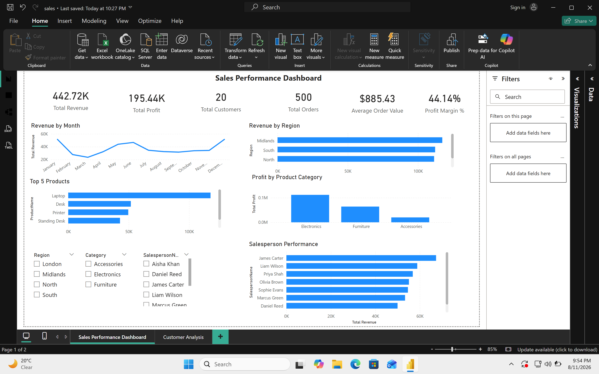
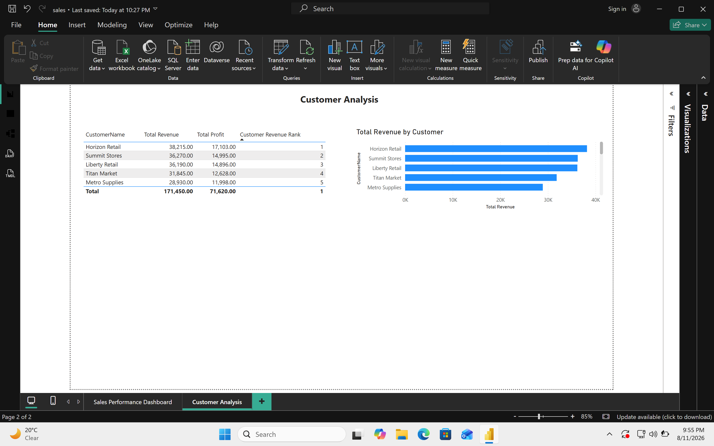

# Sales Performance Analytics Dashboard

## Overview

This project analyses sales data using SQL and Power BI to monitor business performance across customers, products, regions and salespeople. The dashboard focuses on revenue, profitability, order performance and customer trends, providing clear insights to support business decision-making.

## Key Features

Analysed sales data using SQL to calculate revenue, profit and performance across customers, products, regions and salespeople. Built a relational data model connecting sales, customers, products and salespeople. Developed DAX measures to calculate revenue, profit, average order value, profit margin and customer rankings. Created interactive Power BI dashboards with KPI cards, charts, tables and slicers to support sales and customer performance analysis.

## Key Metrics

Total Revenue

Total Profit

Total Orders

Total Customers

Average Order Value

Profit Margin %

## Tools Used

SQL (JOINs, aggregation, GROUP BY, CTEs, RANK window functions)

Power BI (data modelling, DAX measures, RANKX, interactive dashboards)

Excel (data preparation)

## Business Value

This dashboard provides management with visibility into sales and profitability performance across products, customers, regions and salespeople. It enables users to identify top-performing products and customers, compare regional and salesperson performance, monitor revenue trends and support data-driven sales decisions.

## Dashboard Preview

